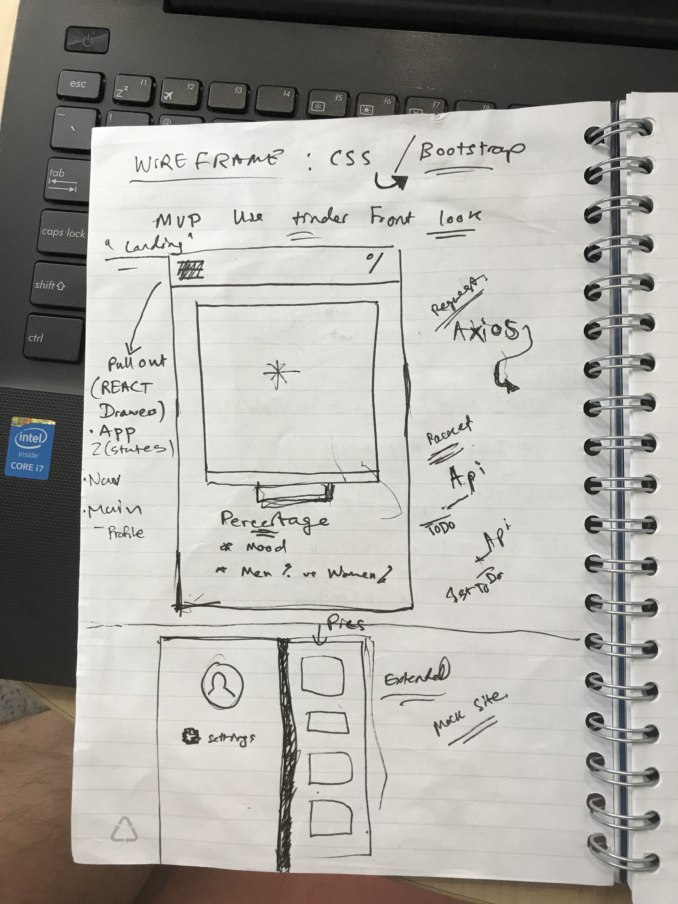
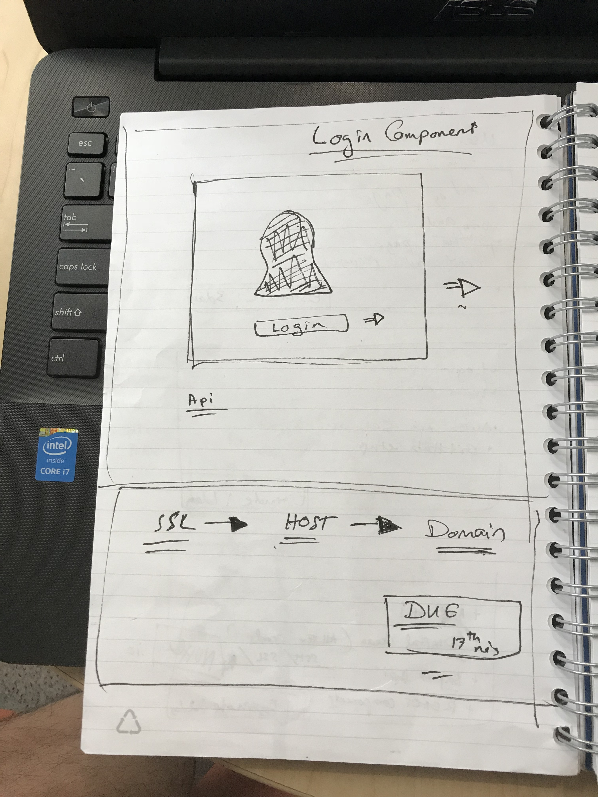

# BRatioApp Outline

# MVP Objective: Give and store the ratio of men and women in a room on a picture, after authenticating through a login that uses face recognition.
 #### ** Ratio
 #### ** Mood of the picture
 #### ** Ages

#### "Main Page"

#### "Login Page"

#### "Save"

# Full Concept: 
#### Dating app based on pictures and associated based on what people chose to share at different locations, hoping to mock this after

# Technologies
#### Node, React, Mongo, Materialize, Express
